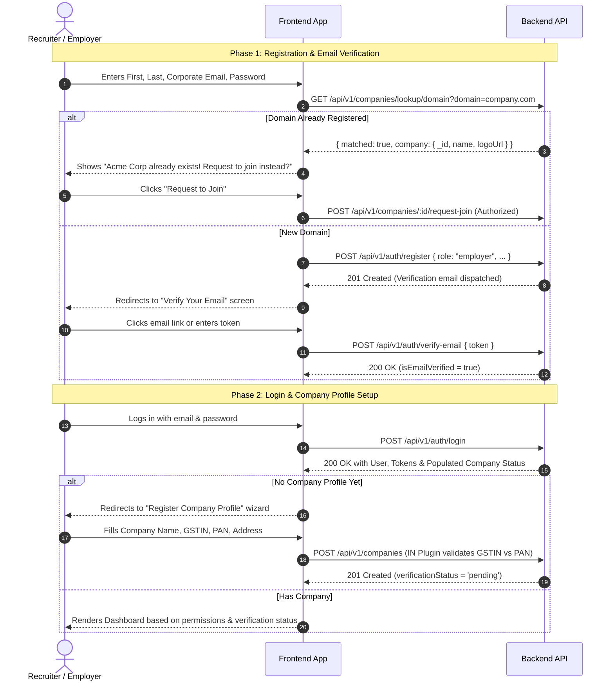

# Employer Authentication, Registration & Team Onboarding — Frontend Integration Guide

> **Base URL:** `/api/v1`  
> **Audience:** Frontend Developers (React, Next.js, Vue, Angular, Mobile)  
> **Authentication:** Standard JWT Bearer token in `Authorization: Bearer <access_token>` header.  
> **Token Storage:** Store `accessToken` in memory/state and `refreshToken` in HttpOnly cookie or secure storage.

---

## Table of Contents
1. [Architecture Overview & Flow Diagrams](#1-architecture-overview--flow-diagrams)
2. [TypeScript Type Definitions](#2-typescript-type-definitions)
3. [Employer Registration Flow](#3-employer-registration-flow)
4. [Email Verification & Resend Flow](#4-email-verification--resend-flow)
5. [Employer Login & Enriched Profile Response](#5-employer-login--enriched-profile-response)
6. [Token Refresh & Rotation (Axios Interceptor)](#6-token-refresh--rotation-axios-interceptor)
7. [Corporate Domain Matching & Join Request](#7-corporate-domain-matching--join-request)
8. [Company Registration (Country Plugins & GSTIN vs PAN)](#8-company-registration-country-plugins--gstin-vs-pan)
9. [Team Member Invitation Lifecycle](#9-team-member-invitation-lifecycle)
10. [Error Codes & Frontend Handling Guide](#10-error-codes--frontend-handling-guide)

---

## 1. Architecture Overview & Flow Diagrams

### Complete Employer Onboarding Journey



---

## 2. TypeScript Type Definitions

Copy these types directly into your frontend project (e.g. `src/types/auth.ts` or `src/types/company.ts`):

```typescript
export type UserRole = 'jobseeker' | 'employer' | 'admin';

export type VerificationStatus = 
  | 'pending'
  | 'under_review'
  | 'information_required'
  | 'approved'
  | 'rejected';

export type TeamPermission = 
  | 'manage_jobs'
  | 'view_applications'
  | 'manage_candidates'
  | 'manage_team'
  | 'manage_billing'
  | 'view_analytics';

export interface CompanySummary {
  _id: string;
  name: string;
  slug: string;
  logoUrl?: string;
  countryCode: string;
  verificationStatus: VerificationStatus;
  isVerified: boolean;
  isOwner: boolean;
  permissions: TeamPermission[];
}

export interface UserProfile {
  _id: string;
  firstName: string;
  lastName: string;
  email: string;
  role: UserRole;
  isEmailVerified: boolean;
  company?: CompanySummary | string | null;
}

export interface AuthTokens {
  accessToken: string;
  refreshToken: string;
}

export interface AuthResponse {
  success: boolean;
  message: string;
  data: {
    user: UserProfile;
    tokens: AuthTokens;
  };
}

export interface CompanyInvitation {
  _id: string;
  company: {
    _id: string;
    name: string;
    slug: string;
    logoUrl?: string;
    countryCode: string;
    verificationStatus: VerificationStatus;
  } | string;
  email: string;
  permissions: TeamPermission[];
  invitedBy: {
    _id: string;
    firstName: string;
    lastName: string;
    email: string;
  };
  token: string;
  expiresAt: string;
  status: 'pending' | 'accepted' | 'revoked' | 'expired';
  createdAt: string;
}
```

---

## 3. Employer Registration Flow

### Endpoint: `POST /api/v1/auth/register`

> [!IMPORTANT]
> **Corporate Email Rule:** If `role: "employer"` is supplied, the backend **strictly rejects personal webmail providers** (`gmail.com`, `yahoo.com`, `hotmail.com`, `rediffmail.com`, etc.).
> Always validate that the user supplies an enterprise/business domain (`name@company.com`) before or during registration.

#### Request Body
```json
{
  "firstName": "Sarah",
  "lastName": "Connor",
  "email": "sarah.connor@cyberdyne.io",
  "password": "SecurePassword123!",
  "confirmPassword": "SecurePassword123!",
  "role": "employer",
  "countryCode": "IN"
}
```

| Field | Type | Required | Validation Rules |
| :--- | :--- | :--- | :--- |
| `firstName` | string | **Yes** | Trimmed, 1–50 characters |
| `lastName` | string | **Yes** | Trimmed, 1–50 characters |
| `email` | string | **Yes** | Valid corporate email format. **No consumer webmail.** |
| `password` | string | **Yes** | 8–128 characters |
| `confirmPassword`| string | **Yes** | Must match `password` exactly |
| `role` | string | **Yes** | Set to `"employer"` |
| `countryCode` | string | Optional | ISO-2 uppercase (`"IN"`, `"US"`, etc.) |

#### Success Response (201 Created)
```json
{
  "success": true,
  "statusCode": 201,
  "message": "Registration successful. Please verify your email.",
  "data": {
    "user": {
      "_id": "64f1a2b3c4d5e6f7a8b9c001",
      "firstName": "Sarah",
      "lastName": "Connor",
      "email": "sarah.connor@cyberdyne.io",
      "role": "employer",
      "isEmailVerified": false
    },
    "tokens": {
      "accessToken": "eyJhbGciOiJIUzI1NiIs...",
      "refreshToken": "eyJhbGciOiJIUzI1NiIs..."
    }
  }
}
```

#### Error Responses

##### 1. Personal Email Provider Rejected (400 Bad Request)
```json
{
  "success": false,
  "statusCode": 400,
  "message": "A business/corporate email address is required to register an employer company profile (e.g., hr@yourcompany.com). Consumer email providers (@gmail.com) are not permitted."
}
```
*Frontend Action:* Highlight the email input in red and display: *"Please enter your work or corporate email address. Personal emails like Gmail/Yahoo are not permitted for employers."*

##### 2. Email Already Exists (409 Conflict)
```json
{
  "success": false,
  "statusCode": 409,
  "message": "An account with this email address already exists"
}
```
*Frontend Action:* Prompt the user to log in or use password reset.

---

## 4. Email Verification & Resend Flow

Employers **must** verify their email address before they can register a company profile or publish job postings.

### 4.1 Verify Email: `POST /api/v1/auth/verify-email`

When the user clicks the link in their email (`https://yourfrontend.com/verify-email?token=xyz`):

#### Request Body
```json
{
  "token": "eyJhbGciOiJIUzI1NiIsInR5cCI6IkpXVCJ9..."
}
```

#### Success Response (200 OK)
```json
{
  "success": true,
  "statusCode": 200,
  "message": "Email verified successfully."
}
```
*Frontend Action:* Update user state `isEmailVerified: true` and redirect to company registration or dashboard.

---

### 4.2 Resend Verification Email: `POST /api/v1/auth/resend-verification-email`

If the email was lost or expired:

#### Request Body
```json
{
  "email": "sarah.connor@cyberdyne.io"
}
```

#### Success Response (200 OK)
```json
{
  "success": true,
  "statusCode": 200,
  "message": "If an unverified account with that email exists, a new verification link has been sent."
}
```

#### Error: Already Verified (400 Bad Request)
```json
{
  "success": false,
  "statusCode": 400,
  "message": "This email address is already verified"
}
```

*Frontend Recommendation:* Implement a 60-second cooldown timer on the "Resend Email" button to prevent rate limiting.

---

## 5. Employer Login & Enriched Profile Response

### Endpoint: `POST /api/v1/auth/login`

The backend now returns the full company profile, verification state, and permissions directly in the login response.

#### Request Body
```json
{
  "email": "sarah.connor@cyberdyne.io",
  "password": "SecurePassword123!"
}
```

#### Success Response (200 OK)
```json
{
  "success": true,
  "statusCode": 200,
  "message": "Login successful",
  "data": {
    "user": {
      "_id": "64f1a2b3c4d5e6f7a8b9c001",
      "firstName": "Sarah",
      "lastName": "Connor",
      "email": "sarah.connor@cyberdyne.io",
      "role": "employer",
      "isEmailVerified": true,
      "company": {
        "_id": "64f1a2b3c4d5e6f7a8b9c999",
        "name": "Cyberdyne Systems",
        "slug": "cyberdyne-systems-k8s9a1",
        "logoUrl": "https://cdn.hireengine.com/logos/cyberdyne.png",
        "countryCode": "IN",
        "verificationStatus": "approved",
        "isVerified": true,
        "isOwner": true,
        "permissions": [
          "manage_jobs",
          "view_applications",
          "manage_candidates",
          "manage_team",
          "manage_billing",
          "view_analytics"
        ]
      }
    },
    "tokens": {
      "accessToken": "eyJhbGciOiJIUzI1NiIsInR5cCI6IkpXVCJ9...",
      "refreshToken": "eyJhbGciOiJIUzI1NiIsInR5cCI6IkpXVCJ9..."
    }
  }
}
```

### Frontend Routing Logic after Login:
```javascript
if (!user.isEmailVerified) {
  router.push('/verify-email-notice');
} else if (!user.company) {
  router.push('/onboarding/company-setup');
} else if (user.company.verificationStatus === 'pending') {
  router.push('/employer/dashboard?notice=verification_pending');
} else if (user.company.verificationStatus === 'information_required') {
  router.push('/employer/company/documents?action=upload_missing');
} else {
  router.push('/employer/dashboard');
}
```

#### Company Rejection Error (403 Forbidden)
If platform admins rejected the company profile for compliance reasons:
```json
{
  "success": false,
  "statusCode": 403,
  "message": "Your company profile verification was rejected: Provided GST certificate does not match the legal entity name. Please contact support."
}
```
*Frontend Action:* Display the compliance rejection notice banner with support contact links.

---

## 6. Token Refresh & Rotation (Axios Interceptor)

Refresh tokens are now **hashed and validated against the database on each refresh**, with automatic cryptographic token rotation.

### Endpoint: `POST /api/v1/auth/refresh-token`

#### Request Body
```json
{
  "refreshToken": "eyJhbGciOiJIUzI1NiIsInR5cCI6IkpXVCJ9..."
}
```

#### Success Response (200 OK)
```json
{
  "success": true,
  "statusCode": 200,
  "message": "Token refreshed successfully",
  "data": {
    "accessToken": "eyJhbGciOiJIUzI1NiIsInR5cCI6IkpXVCJ9.NEW_ACCESS_TOKEN...",
    "refreshToken": "eyJhbGciOiJIUzI1NiIsInR5cCI6IkpXVCJ9.NEW_REFRESH_TOKEN..."
  }
}
```

> [!WARNING]
> **Token Rotation Rule:** Every call to `/refresh-token` issues a **new** `refreshToken` and invalidates the previous one. You **must** overwrite the stored `refreshToken` with the new one returned in `data.refreshToken`. If an old token is reused, the user session is immediately revoked.

### Production Axios Interceptor Example

```typescript
import axios from 'axios';

const api = axios.create({
  baseURL: process.env.NEXT_PUBLIC_API_URL || 'http://localhost:5000/api/v1',
});

// Request interceptor: attach access token
api.interceptors.request.use((config) => {
  const token = localStorage.getItem('accessToken');
  if (token && config.headers) {
    config.headers.Authorization = `Bearer ${token}`;
  }
  return config;
});

// Response interceptor: auto-refresh on 401
let isRefreshing = false;
let failedQueue: Array<{ resolve: (token: string) => void; reject: (err: any) => void }> = [];

const processQueue = (error: any, token: string | null = null) => {
  failedQueue.forEach((prom) => {
    if (token) {
      prom.resolve(token);
    } else {
      prom.reject(error);
    }
  });
  failedQueue = [];
};

api.interceptors.response.use(
  (response) => response,
  async (error) => {
    const originalRequest = error.config;

    if (error.response?.status === 401 && !originalRequest._retry) {
      if (originalRequest.url?.includes('/auth/refresh-token')) {
        // Refresh token itself expired or revoked -> force logout
        localStorage.clear();
        window.location.href = '/login?session_expired=true';
        return Promise.reject(error);
      }

      if (isRefreshing) {
        return new Promise((resolve, reject) => {
          failedQueue.push({
            resolve: (token: string) => {
              originalRequest.headers['Authorization'] = `Bearer ${token}`;
              resolve(api(originalRequest));
            },
            reject: (err: any) => reject(err),
          });
        });
      }

      originalRequest._retry = true;
      isRefreshing = true;

      try {
        const storedRefreshToken = localStorage.getItem('refreshToken');
        if (!storedRefreshToken) throw new Error('No refresh token');

        const { data } = await axios.post(`${api.defaults.baseURL}/auth/refresh-token`, {
          refreshToken: storedRefreshToken,
        });

        const { accessToken, refreshToken: newRefreshToken } = data.data;

        localStorage.setItem('accessToken', accessToken);
        localStorage.setItem('refreshToken', newRefreshToken);

        api.defaults.headers.common['Authorization'] = `Bearer ${accessToken}`;
        processQueue(null, accessToken);

        return api(originalRequest);
      } catch (refreshErr) {
        processQueue(refreshErr, null);
        localStorage.clear();
        window.location.href = '/login?session_expired=true';
        return Promise.reject(refreshErr);
      } finally {
        isRefreshing = false;
      }
    }

    return Promise.reject(error);
  }
);

export default api;
```

---

## 7. Corporate Domain Matching & Join Request

When a recruiter types their email into the registration form (e.g. `alex@uber.com`), query the domain endpoint to check if their company is already on the platform.

### 7.1 Check Corporate Domain: `GET /api/v1/companies/lookup/domain?domain=uber.com`

*No authentication required.*

#### Query Parameters
| Parameter | Type | Example |
| :--- | :--- | :--- |
| `domain` | string | `uber.com` or `recruiter@uber.com` |

#### Response: Match Found (200 OK)
```json
{
  "success": true,
  "statusCode": 200,
  "message": "Domain lookup result",
  "data": {
    "matched": true,
    "company": {
      "_id": "64f1a2b3c4d5e6f7a8b9c111",
      "name": "Uber Technologies Inc",
      "slug": "uber-technologies-inc",
      "logoUrl": "https://cdn.example.com/uber.png",
      "countryCode": "US",
      "verificationStatus": "approved"
    }
  }
}
```

#### Response: No Match (200 OK)
```json
{
  "success": true,
  "statusCode": 200,
  "message": "Domain lookup result",
  "data": {
    "matched": false
  }
}
```

---

### 7.2 Request to Join Existing Company: `POST /api/v1/companies/:id/request-join`

*Requires Authorization: Bearer <access_token>*

If the company profile already exists, instead of attempting to register a duplicate company, the user sends a join request to the company owner.

#### Response (200 OK)
```json
{
  "success": true,
  "statusCode": 200,
  "message": "A request to join Uber Technologies Inc has been sent to the company administrator.",
  "data": {
    "success": true
  }
}
```

---

## 8. Company Registration (Country Plugins & GSTIN vs PAN)

### Endpoint: `POST /api/v1/companies`

*Requires Authorization: Bearer <access_token>*

#### Multi-Country Headers & Rules:
Pass the header `X-Country-Code: IN` or include `countryCode: "IN"` in the body.

### 8.1 India Registration Payload (`countryCode: "IN"`)

> [!CAUTION]
> **GSTIN vs PAN Cross-Validation Rule:**
> Characters 3 through 12 of the 15-digit `gstNumber` **must match the 10-digit `panNumber` exactly**.
> - Example: If PAN is `ABCDE1234F`, GSTIN must be formatted as `27` + `ABCDE1234F` + `1Z5` -> `27ABCDE1234F1Z5`.

#### Request Body (India)
```json
{
  "name": "Acme Infotech Private Limited",
  "countryCode": "IN",
  "phone": "+919876543210",
  "contactName": "Rahul Sharma",
  "website": "https://www.acmeinfotech.in",
  "industry": "Information Technology",
  "size": "51-200",
  "registrationDetails": {
    "gstNumber": "27ABCDE1234F1Z5",
    "panNumber": "ABCDE1234F",
    "cinNumber": "U72200MH2015PTC123456",
    "registeredAddress": {
      "street": "100 MG Road, Bandra West",
      "city": "Mumbai",
      "state": "MH",
      "pincode": "400050"
    }
  }
}
```

#### GSTIN / PAN Mismatch Error (400 Bad Request)
```json
{
  "success": false,
  "statusCode": 400,
  "message": "Business verification validation failed for India",
  "data": [
    {
      "field": "gstNumber",
      "message": "GSTIN PAN mismatch: Characters 3-12 of GSTIN (AAAAA0000A) must match the provided PAN (ABCDE1234F)"
    }
  ]
}
```

---

### 8.2 United States Registration Payload (`countryCode: "US"`)

#### Request Body (US)
```json
{
  "name": "Acme Labs Inc",
  "countryCode": "US",
  "phone": "+14155552671",
  "contactName": "John Miller",
  "website": "https://www.acmelabs.io",
  "industry": "Software",
  "size": "11-50",
  "registrationDetails": {
    "einNumber": "12-3456789",
    "registeredAddress": {
      "street": "500 Howard Street, Suite 400",
      "city": "San Francisco",
      "state": "CA",
      "postalCode": "94105"
    }
  }
}
```

---

## 9. Team Member Invitation Lifecycle

Company owners can invite hiring managers and recruiters to collaborate with granular permissions.

### 9.1 Send Invitation: `POST /api/v1/companies/:id/invitations`

*Caller must be Company Owner.*

#### Request Body
```json
{
  "email": "hiring.manager@cyberdyne.io",
  "permissions": ["manage_jobs", "view_applications", "manage_candidates"]
}
```

#### Available Permission Keys:
- `"manage_jobs"` — Create, edit, and publish jobs
- `"view_applications"` — View applicant lists and resumes
- `"manage_candidates"` — Update pipeline stages, rate applicants, add interview notes
- `"manage_team"` — Invite and remove team members
- `"manage_billing"` — Manage subscriptions, view invoices and payment methods
- `"view_analytics"` — Access hiring analytics and conversion reports

#### Response (201 Created)
```json
{
  "success": true,
  "statusCode": 201,
  "message": "Team invitation sent successfully",
  "data": {
    "_id": "64f1a2b3c4d5e6f7a8b9c333",
    "company": "64f1a2b3c4d5e6f7a8b9c999",
    "email": "hiring.manager@cyberdyne.io",
    "permissions": ["manage_jobs", "view_applications", "manage_candidates"],
    "token": "4f9d8a1c7e2b6d5f0a3e9c8b7d6a5f4e3c2b1a0d9e8f7a6b5c4d3e2f1a0b9c8d",
    "expiresAt": "2026-09-19T11:45:00.000Z",
    "status": "pending"
  }
}
```

---

### 9.2 List Pending Invitations: `GET /api/v1/companies/:id/invitations`

*Caller must have team access.*

#### Response (200 OK)
```json
{
  "success": true,
  "statusCode": 200,
  "message": "Company invitations retrieved successfully",
  "data": [
    {
      "_id": "64f1a2b3c4d5e6f7a8b9c333",
      "email": "hiring.manager@cyberdyne.io",
      "permissions": ["manage_jobs", "view_applications"],
      "token": "4f9d8a1c7e2b6d5f...",
      "status": "pending",
      "expiresAt": "2026-09-19T11:45:00.000Z",
      "invitedBy": {
        "_id": "64f1a2b3c4d5e6f7a8b9c001",
        "firstName": "Sarah",
        "lastName": "Connor",
        "email": "sarah.connor@cyberdyne.io"
      }
    }
  ]
}
```

---

### 9.3 Revoke Invitation: `DELETE /api/v1/companies/:id/invitations/:inviteId`

*Caller must be Company Owner.*

#### Response (200 OK)
```json
{
  "success": true,
  "statusCode": 200,
  "message": "Invitation revoked successfully"
}
```

---

### 9.4 Invitation Landing Page: `GET /api/v1/companies/invitations/:token`

*Public endpoint.* Call this when the invited user loads the invitation link (`/accept-invitation?token=<token>`).

#### Response (200 OK)
```json
{
  "success": true,
  "statusCode": 200,
  "message": "Invitation retrieved successfully",
  "data": {
    "email": "hiring.manager@cyberdyne.io",
    "permissions": ["manage_jobs", "view_applications"],
    "company": {
      "_id": "64f1a2b3c4d5e6f7a8b9c999",
      "name": "Cyberdyne Systems",
      "slug": "cyberdyne-systems",
      "logoUrl": "https://cdn.example.com/logo.png",
      "countryCode": "IN",
      "verificationStatus": "approved"
    },
    "invitedBy": {
      "firstName": "Sarah",
      "lastName": "Connor",
      "email": "sarah.connor@cyberdyne.io"
    },
    "expiresAt": "2026-09-19T11:45:00.000Z"
  }
}
```

---

### 9.5 Accept Invitation: `POST /api/v1/companies/invitations/:token/accept`

#### Case A: User Does Not Have an Account Yet
The user sets their name and password to register and join simultaneously:
```json
{
  "firstName": "Kyle",
  "lastName": "Reese",
  "password": "Password123!"
}
```

#### Case B: User Is Already Logged In
Send with `Authorization: Bearer <token>`. The body can be empty `{}`.

#### Response (200 OK)
Returns user profile, company details, and fresh auth tokens:
```json
{
  "success": true,
  "statusCode": 200,
  "message": "Invitation accepted successfully",
  "data": {
    "user": {
      "_id": "64f1a2b3c4d5e6f7a8b9c888",
      "firstName": "Kyle",
      "lastName": "Reese",
      "email": "hiring.manager@cyberdyne.io",
      "role": "employer",
      "company": "64f1a2b3c4d5e6f7a8b9c999"
    },
    "tokens": {
      "accessToken": "eyJhbGciOiJIUzI1NiIs...",
      "refreshToken": "eyJhbGciOiJIUzI1NiIs..."
    }
  }
}
```

---

## 10. Error Codes & Frontend Handling Guide

| HTTP Status | Error Scenario | API Error Message | Recommended Frontend Behavior |
| :---: | :--- | :--- | :--- |
| **400** | Free Email for Employer | *"A business/corporate email address is required..."* | Display inline validation error on email field. |
| **400** | GSTIN vs PAN Mismatch | *"GSTIN PAN mismatch: Characters 3-12 of GSTIN must match PAN"* | Highlight both GST and PAN fields. Show help tooltip. |
| **400** | Expired/Invalid Invite | *"This team invitation is invalid or has expired"* | Show error card: *"Invitation Expired"*, prompt to request a new invite. |
| **401** | Invalid/Reused Refresh Token | *"Invalid, revoked or expired refresh token"* | Clear local storage and redirect to `/login?session_expired=true`. |
| **403** | Company Rejected | *"Your company profile verification was rejected: ..."* | Render compliance banner with reason and support button. |
| **403** | Missing RBAC Permission | *"Access denied. You need the '...' permission..."* | Hide unauthorized buttons/tabs; show notification toast if triggered. |
| **409** | Corporate Domain Already Registered | *"A company profile with the domain '...' is already registered"* | Show modal: *"Your company is already registered. Request to join instead."* |
| **429** | Rate Limited | *"Too many requests. Please try again later."* | Show timer / cooldown banner before allowing retry. |

---

## Developer Support Checklist
- [x] All endpoints use consistent `{ success: boolean, statusCode: number, message: string, data: any }` envelope.
- [x] CORS and headers configured for standard authorization headers.
- [x] All ISO-2 country codes supported via Country Plugin registry.
- [x] Refresh token rotation is automatic; store both `accessToken` and `refreshToken` securely.
