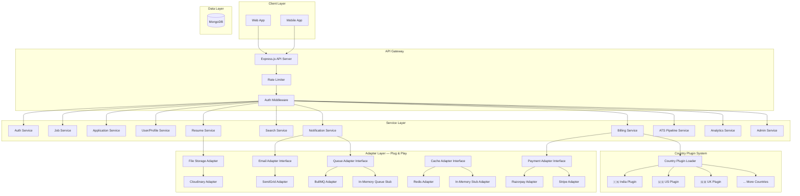
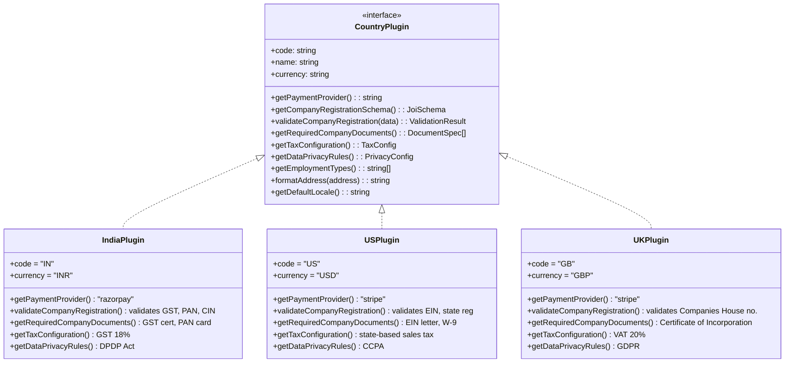
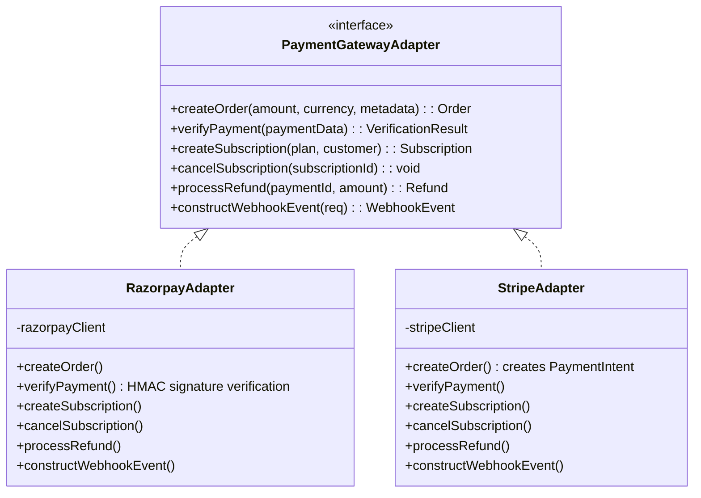
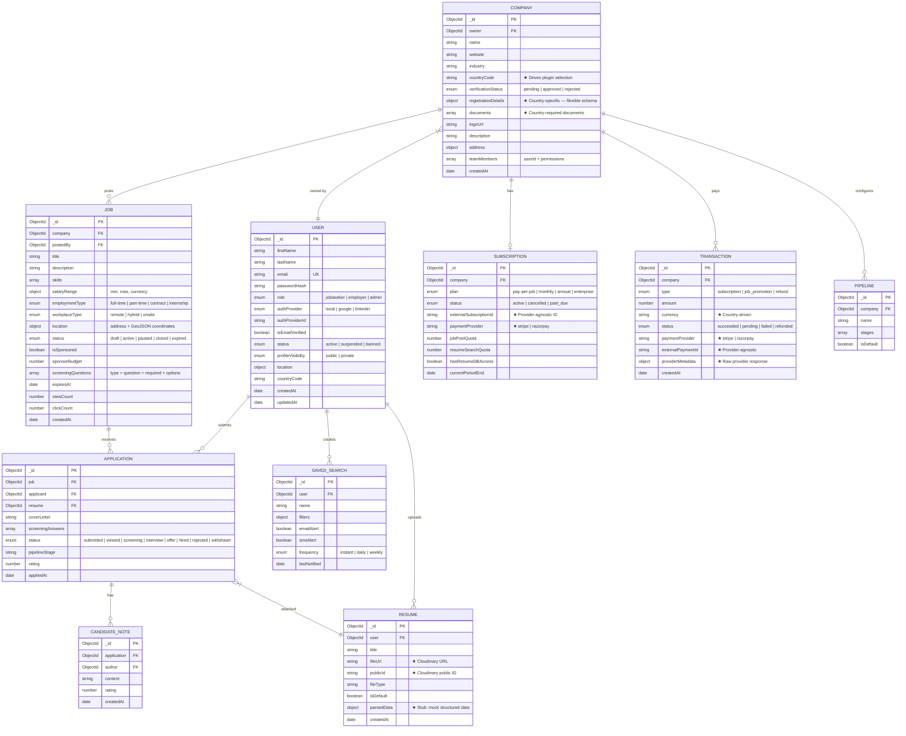
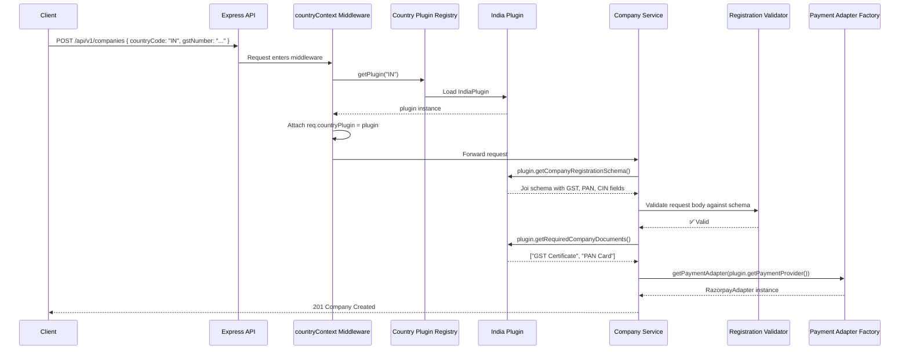

# Hire Engine Backend — Production-Ready Job Portal API

A scalable, production-grade backend for a Monster Jobs–style hiring platform built with **Node.js, Express.js, Mongoose & MongoDB**.

Designed for **multi-country operation** with a plug-and-play architecture for country-specific compliance, payment gateways, and regulations.

---

## Architecture Overview



---

## Key Architectural Decisions

### 1. Country Plugin System (Strategy Pattern — Zero if-else)

Instead of scattering country-specific logic with `if (country === 'IN')` checks, each country is a **self-contained plugin** that implements a standard interface. The system loads the correct plugin at runtime based on the company's operating country.



**Adding a new country = adding a single folder. No existing code is touched.**

```
src/plugins/countries/
├── index.js              # Plugin loader & registry
├── countryPlugin.base.js # Base class / interface definition
├── IN/                   # India
│   ├── index.js          # Exports IndiaPlugin
│   ├── registration.js   # GST/PAN/CIN validation
│   ├── tax.js            # GST config
│   └── privacy.js        # DPDP Act rules
├── US/                   # United States
│   ├── index.js
│   ├── registration.js   # EIN/state registration
│   ├── tax.js            # State sales tax
│   └── privacy.js        # CCPA rules
└── GB/                   # United Kingdom
    ├── index.js
    ├── registration.js   # Companies House
    ├── tax.js            # VAT
    └── privacy.js        # GDPR
```

### 2. Modular Payment Gateway (Adapter Pattern)

Every payment adapter implements the same `PaymentGatewayAdapter` interface. The billing service never knows which provider it's talking to.



```
src/adapters/payment/
├── index.js                  # Factory: getPaymentAdapter(providerName)
├── paymentGateway.adapter.js # Interface / base class
├── stripe.adapter.js         # Stripe implementation
└── razorpay.adapter.js       # Razorpay implementation
```

### 3. Stubbed Infrastructure (Redis, Queue, Resume Parsing)

All infrastructure dependencies are **behind adapter interfaces** so they can be swapped between real implementations and in-memory stubs.

| Dependency | Production | Dev/Stub |
|-----------|------------|----------|
| **Cache** | Redis via `ioredis` | In-memory `Map` |
| **Job Queue** | BullMQ (Redis-backed) | In-memory array with `setTimeout` |
| **Resume Parsing** | Future: 3rd-party API | Stub returning mock parsed data |
| **File Storage** | Cloudinary | Cloudinary (works in dev too with free tier) |
| **Email** | SendGrid | Console logger stub (dev mode) |

---

## Updated Project Structure

```
hire-engine-backend/
├── src/
│   ├── config/                        # App configuration
│   │   ├── index.js                   # Central config loader (env vars)
│   │   ├── database.js                # MongoDB connection with retry logic
│   │   ├── logger.js                  # Winston logger configuration
│   │   └── passport.js                # Passport.js OAuth strategies
│   │
│   ├── adapters/                      # ★ Pluggable infrastructure adapters
│   │   ├── cache/
│   │   │   ├── index.js               # Factory: getCacheAdapter()
│   │   │   ├── cache.adapter.js       # Interface definition
│   │   │   ├── redis.adapter.js       # Real Redis implementation
│   │   │   └── memory.adapter.js      # In-memory Map stub
│   │   ├── queue/
│   │   │   ├── index.js               # Factory: getQueueAdapter()
│   │   │   ├── queue.adapter.js       # Interface definition
│   │   │   ├── bullmq.adapter.js      # Real BullMQ implementation
│   │   │   └── memory.adapter.js      # In-memory stub
│   │   ├── payment/
│   │   │   ├── index.js               # Factory: getPaymentAdapter(provider)
│   │   │   ├── payment.adapter.js     # Interface definition
│   │   │   ├── stripe.adapter.js      # Stripe implementation
│   │   │   └── razorpay.adapter.js    # Razorpay implementation
│   │   ├── storage/
│   │   │   ├── index.js               # Factory: getStorageAdapter()
│   │   │   └── cloudinary.adapter.js  # Cloudinary implementation
│   │   └── email/
│   │       ├── index.js               # Factory: getEmailAdapter()
│   │       ├── email.adapter.js       # Interface definition
│   │       ├── sendgrid.adapter.js    # SendGrid implementation
│   │       └── console.adapter.js     # Dev: logs to console
│   │
│   ├── plugins/                       # ★ Country-specific plugins
│   │   └── countries/
│   │       ├── index.js               # Plugin loader & registry
│   │       ├── base.plugin.js         # Base class with interface contract
│   │       ├── IN/
│   │       │   ├── index.js           # India plugin entry
│   │       │   ├── registration.js    # GST, PAN, CIN validation
│   │       │   ├── tax.js             # GST configuration
│   │       │   └── privacy.js         # DPDP Act rules
│   │       └── US/
│   │           ├── index.js           # US plugin entry
│   │           ├── registration.js    # EIN, state registration
│   │           ├── tax.js             # State sales tax
│   │           └── privacy.js         # CCPA rules
│   │
│   ├── models/                        # Mongoose schemas & models
│   │   ├── User.js
│   │   ├── Company.js                 # Has `countryCode` field → drives plugin selection
│   │   ├── Job.js
│   │   ├── Application.js
│   │   ├── Resume.js
│   │   ├── SavedSearch.js
│   │   ├── Notification.js
│   │   ├── Subscription.js
│   │   ├── Transaction.js
│   │   ├── Pipeline.js
│   │   ├── CandidateNote.js
│   │   ├── EmailTemplate.js
│   │   ├── Flag.js
│   │   ├── Taxonomy.js
│   │   ├── SystemConfig.js
│   │   └── AuditLog.js
│   │
│   ├── routes/                        # Express route definitions
│   │   ├── index.js                   # Route aggregator
│   │   ├── auth.routes.js
│   │   ├── user.routes.js
│   │   ├── job.routes.js
│   │   ├── application.routes.js
│   │   ├── resume.routes.js
│   │   ├── search.routes.js
│   │   ├── company.routes.js
│   │   ├── subscription.routes.js
│   │   ├── pipeline.routes.js
│   │   ├── notification.routes.js
│   │   ├── analytics.routes.js
│   │   └── admin.routes.js
│   │
│   ├── controllers/                   # Request handlers (thin)
│   │   ├── auth.controller.js
│   │   ├── user.controller.js
│   │   ├── job.controller.js
│   │   ├── application.controller.js
│   │   ├── resume.controller.js
│   │   ├── search.controller.js
│   │   ├── company.controller.js
│   │   ├── subscription.controller.js
│   │   ├── pipeline.controller.js
│   │   ├── notification.controller.js
│   │   ├── analytics.controller.js
│   │   └── admin.controller.js
│   │
│   ├── services/                      # Business logic
│   │   ├── auth.service.js
│   │   ├── user.service.js
│   │   ├── job.service.js
│   │   ├── application.service.js
│   │   ├── resume.service.js
│   │   ├── search.service.js
│   │   ├── company.service.js
│   │   ├── subscription.service.js
│   │   ├── pipeline.service.js
│   │   ├── notification.service.js
│   │   ├── analytics.service.js
│   │   ├── admin.service.js
│   │   └── email.service.js
│   │
│   ├── middlewares/
│   │   ├── auth.middleware.js         # JWT verification
│   │   ├── rbac.middleware.js         # Role-based access control
│   │   ├── validate.middleware.js     # Joi request validation
│   │   ├── rateLimiter.middleware.js
│   │   ├── upload.middleware.js       # Multer + Cloudinary
│   │   ├── countryContext.middleware.js # ★ Resolves country plugin for request
│   │   ├── errorHandler.middleware.js
│   │   └── requestLogger.middleware.js
│   │
│   ├── validators/                    # Joi request schemas
│   │   ├── auth.validator.js
│   │   ├── user.validator.js
│   │   ├── job.validator.js
│   │   ├── application.validator.js
│   │   ├── search.validator.js
│   │   ├── company.validator.js
│   │   └── admin.validator.js
│   │
│   ├── utils/
│   │   ├── ApiError.js               # Custom error class
│   │   ├── ApiResponse.js            # Standardized response wrapper
│   │   ├── asyncHandler.js           # Async error wrapper
│   │   ├── constants.js              # All enums & constants
│   │   ├── pagination.js             # Pagination helpers
│   │   ├── tokens.js                 # JWT helpers
│   │   └── resumeParser.js           # ★ Stub — returns mock parsed data
│   │
│   ├── jobs/                          # Background job processors
│   │   ├── emailWorker.js            # Process email sending
│   │   └── alertWorker.js            # Process saved search alerts
│   │
│   └── app.js                        # Express app setup
│
├── tests/
│   ├── unit/
│   │   └── services/
│   ├── integration/
│   │   └── routes/
│   └── setup.js
│
├── scripts/
│   └── seed.js
│
├── server.js                          # Entry point
├── package.json
├── .env.example
├── .eslintrc.json
├── .prettierrc
└── README.md
```

---

## Data Model Design



---

## Country Plugin System — Detailed Design

### How It Works (Runtime Flow)



### Country Plugin Interface Contract

Every country plugin must implement these methods:

```javascript
// src/plugins/countries/base.plugin.js
class BaseCountryPlugin {
  get code()       { throw new Error('Must implement: country ISO code'); }
  get name()       { throw new Error('Must implement: country name'); }
  get currency()   { throw new Error('Must implement: currency code'); }
  get locale()     { throw new Error('Must implement: default locale'); }

  // ★ Company Registration — each country has different legal requirements
  getCompanyRegistrationSchema() { /* Returns Joi schema */ }
  validateCompanyRegistration(data) { /* Custom validation logic */ }
  getRequiredCompanyDocuments() { /* Array of required document types */ }

  // ★ Tax & Billing — GST vs Sales Tax vs VAT
  getTaxConfiguration() { /* { rate, type, name } */ }
  calculateTax(amount) { /* Returns tax amount */ }

  // ★ Payment Provider — Razorpay for India, Stripe for US/UK
  getPaymentProvider() { /* Returns provider name string */ }

  // ★ Data Privacy & Compliance — GDPR, CCPA, DPDP
  getDataPrivacyRules() { /* Retention periods, consent requirements */ }
  getDataDeletionPolicy() { /* How to handle deletion requests */ }

  // ★ Employment Types — may vary by labor law
  getEmploymentTypes() { /* Allowed employment classifications */ }

  // ★ Address Formatting
  formatAddress(address) { /* Country-specific formatting */ }
}
```

### Adding a New Country

To add support for a new country (e.g., Germany 🇩🇪), a developer simply:

1. Creates `src/plugins/countries/DE/index.js`
2. Extends `BaseCountryPlugin`
3. Implements all required methods
4. **That's it** — the plugin loader auto-discovers it. Zero changes to existing code.

---

## Adapter Interfaces — Detailed Design

### Payment Gateway Adapter

```javascript
// src/adapters/payment/payment.adapter.js — Interface
class PaymentGatewayAdapter {
  async createOrder(amount, currency, metadata) { }
  async verifyPayment(paymentData) { }
  async createSubscription(planId, customerData) { }
  async cancelSubscription(subscriptionId) { }
  async processRefund(paymentId, amount, reason) { }
  constructWebhookEvent(req) { }
}
```

The factory auto-selects the adapter:
```javascript
// Usage in billing service — never references Stripe or Razorpay directly
const paymentAdapter = getPaymentAdapter(company.countryPlugin.getPaymentProvider());
const order = await paymentAdapter.createOrder(999, 'INR', { companyId: '...' });
```

### Cache Adapter (Redis Stub)

```javascript
// src/adapters/cache/cache.adapter.js — Interface
class CacheAdapter {
  async get(key) { }
  async set(key, value, ttlSeconds) { }
  async del(key) { }
  async exists(key) { }
  async flushPattern(pattern) { }
}

// memory.adapter.js — In-memory stub using Map + setTimeout for TTL
// redis.adapter.js  — Real Redis via ioredis (enabled via CACHE_DRIVER=redis)
```

### Queue Adapter (BullMQ Stub)

```javascript
// src/adapters/queue/queue.adapter.js — Interface
class QueueAdapter {
  async addJob(queueName, jobName, data, options) { }
  async processJobs(queueName, handler) { }
}

// memory.adapter.js — Processes jobs synchronously via setTimeout
// bullmq.adapter.js — Real BullMQ (enabled via QUEUE_DRIVER=bullmq)
```

---

## API Endpoints

### Auth Module
| Method | Endpoint | Description |
|--------|----------|-------------|
| POST | `/api/v1/auth/register` | Register with email + password |
| POST | `/api/v1/auth/login` | Login, returns JWT access + refresh tokens |
| POST | `/api/v1/auth/refresh-token` | Refresh expired access token |
| POST | `/api/v1/auth/logout` | Blacklist refresh token |
| GET | `/api/v1/auth/google` | Google OAuth redirect |
| GET | `/api/v1/auth/google/callback` | Google OAuth callback |
| GET | `/api/v1/auth/linkedin` | LinkedIn OAuth redirect |
| GET | `/api/v1/auth/linkedin/callback` | LinkedIn OAuth callback |
| POST | `/api/v1/auth/verify-email` | Email verification with token |
| POST | `/api/v1/auth/forgot-password` | Send password reset email |
| POST | `/api/v1/auth/reset-password` | Reset password with token |

### User / Profile Module
| Method | Endpoint | Description |
|--------|----------|-------------|
| GET | `/api/v1/users/me` | Get current user profile |
| PATCH | `/api/v1/users/me` | Update profile |
| PATCH | `/api/v1/users/me/visibility` | Toggle public/private |
| DELETE | `/api/v1/users/me` | GDPR deletion request |

### Resume Module
| Method | Endpoint | Description |
|--------|----------|-------------|
| POST | `/api/v1/resumes/upload` | Upload resume to Cloudinary, stub-parse |
| GET | `/api/v1/resumes` | List user's resumes |
| GET | `/api/v1/resumes/:id` | Get specific resume |
| PATCH | `/api/v1/resumes/:id` | Update metadata / set default |
| DELETE | `/api/v1/resumes/:id` | Delete resume (+ Cloudinary cleanup) |

### Job Module
| Method | Endpoint | Description |
|--------|----------|-------------|
| POST | `/api/v1/jobs` | Create job posting (employer) |
| GET | `/api/v1/jobs` | List/search jobs (public) |
| GET | `/api/v1/jobs/:id` | Get job details |
| PATCH | `/api/v1/jobs/:id` | Update job posting |
| PATCH | `/api/v1/jobs/:id/status` | Pause / repost / close |
| POST | `/api/v1/jobs/:id/promote` | Promote/sponsor a listing |
| GET | `/api/v1/jobs/employer/my-jobs` | Employer's own listings |

### Application Module
| Method | Endpoint | Description |
|--------|----------|-------------|
| POST | `/api/v1/jobs/:jobId/apply` | Apply (Easy Apply) |
| GET | `/api/v1/applications/me` | Seeker's application history |
| GET | `/api/v1/jobs/:jobId/applications` | Employer: view applicants |
| PATCH | `/api/v1/applications/:id/status` | Move through pipeline |
| POST | `/api/v1/applications/:id/notes` | Add recruiter note |
| POST | `/api/v1/applications/:id/rate` | Rate candidate |
| POST | `/api/v1/applications/bulk-email` | Bulk email to applicants |

### Search Module
| Method | Endpoint | Description |
|--------|----------|-------------|
| GET | `/api/v1/search/jobs` | Advanced job search (keywords, filters, geo) |
| GET | `/api/v1/search/resumes` | Resume DB search (employer, Boolean) |
| POST | `/api/v1/search/saved` | Save search with alerts |
| GET | `/api/v1/search/saved` | List saved searches |
| DELETE | `/api/v1/search/saved/:id` | Delete saved search |

### Company Module
| Method | Endpoint | Description |
|--------|----------|-------------|
| POST | `/api/v1/companies` | Register company ★ country-plugin-validated |
| GET | `/api/v1/companies/:id` | Get company profile |
| PATCH | `/api/v1/companies/:id` | Update company |
| POST | `/api/v1/companies/:id/team` | Add team member |
| PATCH | `/api/v1/companies/:id/team/:userId` | Update permissions |
| DELETE | `/api/v1/companies/:id/team/:userId` | Remove team member |

### Subscription & Billing Module
| Method | Endpoint | Description |
|--------|----------|-------------|
| GET | `/api/v1/subscriptions/plans` | List plans |
| POST | `/api/v1/subscriptions` | Subscribe ★ uses country payment adapter |
| PATCH | `/api/v1/subscriptions` | Change plan |
| DELETE | `/api/v1/subscriptions` | Cancel |
| GET | `/api/v1/subscriptions/transactions` | Transaction history |
| POST | `/api/v1/webhooks/payment` | ★ Generic webhook (routes to correct adapter) |

### Pipeline (ATS) Module
| Method | Endpoint | Description |
|--------|----------|-------------|
| POST | `/api/v1/pipelines` | Create custom pipeline |
| GET | `/api/v1/pipelines` | List company pipelines |
| PATCH | `/api/v1/pipelines/:id` | Update stages |
| DELETE | `/api/v1/pipelines/:id` | Delete pipeline |

### Notification Module
| Method | Endpoint | Description |
|--------|----------|-------------|
| GET | `/api/v1/notifications` | Get notifications |
| PATCH | `/api/v1/notifications/:id/read` | Mark as read |
| PATCH | `/api/v1/notifications/read-all` | Mark all read |

### Analytics Module
| Method | Endpoint | Description |
|--------|----------|-------------|
| GET | `/api/v1/analytics/jobs/:jobId` | Job analytics |
| GET | `/api/v1/analytics/jobs/:jobId/demographics` | Applicant demographics |
| GET | `/api/v1/analytics/company/overview` | Company-wide stats |

### Admin Module
| Method | Endpoint | Description |
|--------|----------|-------------|
| GET | `/api/v1/admin/employers/pending` | Pending verifications |
| PATCH | `/api/v1/admin/employers/:id/verify` | Approve/reject |
| PATCH | `/api/v1/admin/users/:id/suspend` | Suspend/ban user |
| GET | `/api/v1/admin/flags` | View flagged content |
| PATCH | `/api/v1/admin/flags/:id` | Resolve flag |
| GET | `/api/v1/admin/taxonomy` | Get taxonomy |
| POST | `/api/v1/admin/taxonomy` | Add entry |
| PATCH | `/api/v1/admin/taxonomy/:id` | Update entry |
| GET | `/api/v1/admin/config` | System config |
| PATCH | `/api/v1/admin/config` | Update config |
| GET | `/api/v1/admin/reports/overview` | Executive metrics |
| GET | `/api/v1/admin/transactions` | All transactions |
| POST | `/api/v1/admin/transactions/:id/refund` | Process refund |
| GET | `/api/v1/admin/audit-logs` | Audit trail |
| POST | `/api/v1/admin/users/:id/gdpr-delete` | GDPR deletion |

---

## Production Best Practices

| Category | Implementation |
|----------|----------------|
| **Security** | Helmet, CORS, rate limiting, bcrypt, JWT access+refresh, NoSQL sanitization, XSS, HPP |
| **Error Handling** | Custom `ApiError`, global handler, async wrapper, operational vs programmer errors |
| **Validation** | Joi schemas on every endpoint + country-specific dynamic schemas |
| **Logging** | Winston structured JSON, request logging, correlation IDs |
| **Auth** | JWT + OAuth 2.0 (Google, LinkedIn), email verification |
| **Authorization** | RBAC middleware (`jobseeker`, `employer`, `admin`) + company team permissions |
| **Database** | Mongoose with text/geo/compound indexes, connection retry, lean queries |
| **File Storage** | Cloudinary with Multer middleware |
| **Email** | SendGrid adapter (console stub in dev) |
| **Caching** | Adapter pattern — Redis or in-memory stub |
| **Background Jobs** | Adapter pattern — BullMQ or in-memory stub |
| **Payments** | Adapter pattern — Stripe, Razorpay (auto-selected by country plugin) |
| **Multi-Country** | Plugin system — zero if-else, open-closed principle |
| **API Design** | RESTful, versioned (`/api/v1`), consistent response format |
| **Graceful Shutdown** | SIGTERM/SIGINT handling, close DB + HTTP |

---

## Implementation Phases

| Phase | Scope | Est. Files |
|-------|-------|-----------|
| **1** | Foundation: package.json, config, env, linting | ~8 files |
| **2** | Utilities, middleware, constants | ~12 files |
| **3** | Adapters (cache, queue, payment, storage, email) | ~14 files |
| **4** | Country plugins (India, US) | ~9 files |
| **5** | Mongoose models (16 models) | ~16 files |
| **6** | Validators (Joi schemas) | ~7 files |
| **7** | Auth module (routes, controller, service) | ~3 files |
| **8** | User, Resume, Job modules | ~9 files |
| **9** | Application, Search, Company modules | ~9 files |
| **10** | Subscription, Pipeline, Notification modules | ~9 files |
| **11** | Analytics, Admin modules | ~6 files |
| **12** | Background workers, app.js, server.js | ~5 files |
| **13** | Seed script, README | ~2 files |
| | **Total** | **~109 files** |

---

## Verification Plan

### Automated
```bash
npm run lint       # ESLint
npm run dev        # Start server, verify boot sequence
```

### Manual Verification
- Server starts without errors, connects to MongoDB
- All routes respond with proper status codes
- Auth flow: register → verify email → login → access protected route
- Company registration validates country-specific fields
- Payment adapter resolves correctly per country
- File upload to Cloudinary works
- Error handling returns standardized responses
