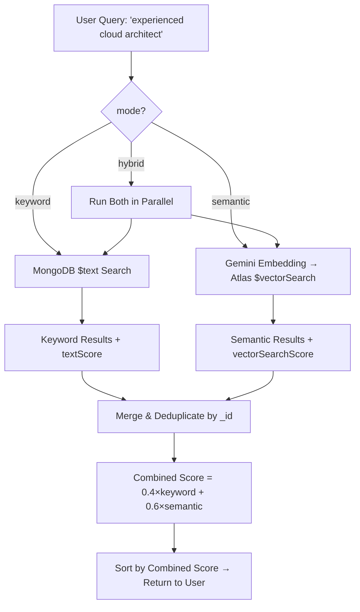

# Semantic Search Implementation — Walkthrough

## Summary

Added Gemini AI-powered semantic search across the Hire Engine backend using **Google Gemini Embedding API** (`gemini-embedding-001`) and **MongoDB Atlas `$vectorSearch`** aggregation. Semantic search is integrated into the existing Boolean resume database search as the default `hybrid` mode.

---

## Files Changed

### Modified Files

| File | What Changed |
|---|---|
| [`config/index.js`](file:///g:/github-hire-engine-monster-jobs/hire-engine-backend/src/config/index.js) | Added `embeddingModel` to gemini config |
| [`gemini.adapter.js`](file:///g:/github-hire-engine-monster-jobs/hire-engine-backend/src/adapters/ai/gemini.adapter.js) | Added `generateEmbedding()` and `generateQueryEmbedding()` |
| [`Resume.js`](file:///g:/github-hire-engine-monster-jobs/hire-engine-backend/src/models/Resume.js) | Added `embedding` sub-document (`vector`, `model`, `generatedAt`) |
| [`Job.js`](file:///g:/github-hire-engine-monster-jobs/hire-engine-backend/src/models/Job.js) | Added `embedding` sub-document |
| [`resume.service.js`](file:///g:/github-hire-engine-monster-jobs/hire-engine-backend/src/services/resume.service.js) | Fire-and-forget embedding generation on upload/reparse |
| [`job.service.js`](file:///g:/github-hire-engine-monster-jobs/hire-engine-backend/src/services/job.service.js) | Fire-and-forget embedding generation on create/update |
| [`search.service.js`](file:///g:/github-hire-engine-monster-jobs/hire-engine-backend/src/services/search.service.js) | Added 3 search modes: `keyword`, `semantic`, `hybrid` (default) |
| [`search.validator.js`](file:///g:/github-hire-engine-monster-jobs/hire-engine-backend/src/validators/search.validator.js) | Added `mode` parameter to both search schemas |
| [`search.controller.js`](file:///g:/github-hire-engine-monster-jobs/hire-engine-backend/src/controllers/search.controller.js) | Added `getSimilarJobs`, `getSimilarResumes`, `getRankedResumesByJob` |
| [`search.routes.js`](file:///g:/github-hire-engine-monster-jobs/hire-engine-backend/src/routes/search.routes.js) | Added 3 new semantic search routes |

### New Files

| File | Purpose |
|---|---|
| [`embedding.service.js`](file:///g:/github-hire-engine-monster-jobs/hire-engine-backend/src/services/embedding.service.js) | Core embedding service — generates/stores vectors, runs `$vectorSearch`, similarity search, and job-based candidate ranking |
| [`backfill-embeddings.js`](file:///g:/github-hire-engine-monster-jobs/hire-engine-backend/scripts/backfill-embeddings.js) | Migration script to backfill embeddings for existing documents |

---

## New API Endpoints

| Method | Endpoint | Auth | Description |
|---|---|---|---|
| `GET` | `/search/jobs?q=...&mode=hybrid` | Public | Job search with semantic AI (keyword/semantic/hybrid) |
| `GET` | `/search/resumes?q=...&mode=hybrid` | Employer/Admin | Resume Boolean + Semantic search (keyword/semantic/hybrid) |
| `GET` | `/search/jobs/similar/:jobId` | Public | Find similar jobs using vector similarity |
| `GET` | `/search/resumes/similar/:resumeId` | Employer/Admin | Find similar candidates using vector similarity |
| `GET` | `/search/resumes/rank-by-job/:jobId` | Employer/Admin | AI-rank all candidates against a specific job |

### Search Mode Parameter

All search endpoints now accept `mode` query parameter:

```
?mode=keyword    → Classic MongoDB $text Boolean search only
?mode=semantic   → Pure Atlas $vectorSearch AI similarity only
?mode=hybrid     → Both combined, weighted merge (keyword 40% + semantic 60%) [DEFAULT]
```

---

## How Hybrid Search Works



Documents appearing in **both** keyword and semantic results get a boosted combined score. The `relevanceScore` field is included in each result document.

---

## How Boolean Resume Search + Semantic AI Works

The existing Boolean resume search (`GET /search/resumes`) now defaults to `hybrid` mode:

1. **Boolean keyword search** runs as before — supports MongoDB `$text` operators like `"exact phrase"`, `term1 term2` (AND), `-excluded` (NOT).
2. **Semantic search** runs in parallel — the query `q` is embedded via Gemini and matched against pre-computed resume embeddings using Atlas `$vectorSearch`.
3. **Results are merged** — deduplicated by `_id`, scored with weighted combination, and sorted by `relevanceScore`.

Filters (skills, experience range, education) are applied in **both** search paths, so results always respect the user's filter constraints.

---

## MongoDB Atlas Vector Search Index Setup

> [!IMPORTANT]
> You must create two Atlas Vector Search indexes for `$vectorSearch` to work. This is done via the **Atlas UI** → Database → Search → Create Search Index → JSON Editor.

### Resume Vector Index

**Index Name:** `resume_vector_index`
**Collection:** `resumes`

```json
{
  "fields": [
    {
      "type": "vector",
      "path": "embedding.vector",
      "numDimensions": 768,
      "similarity": "cosine"
    }
  ]
}
```

### Job Vector Index

**Index Name:** `job_vector_index`
**Collection:** `jobs`

```json
{
  "fields": [
    {
      "type": "vector",
      "path": "embedding.vector",
      "numDimensions": 768,
      "similarity": "cosine"
    }
  ]
}
```

---

## Backfill Existing Data

After creating the Atlas indexes, run the backfill script to generate embeddings for all existing documents:

```bash
# Both resumes and jobs
node scripts/backfill-embeddings.js

# Resumes only
node scripts/backfill-embeddings.js resumes

# Jobs only
node scripts/backfill-embeddings.js jobs
```

The script processes in batches of 10 with rate-limiting delays to stay within Gemini API quotas.

---

## Environment Variables

| Variable | Default | Description |
|---|---|---|
| `GEMINI_API_KEY` | *(required)* | Google Gemini API key |
| `GEMINI_MODEL` | `gemini-3.6-flash` | Model for content generation |
| `GEMINI_EMBEDDING_MODEL` | `gemini-embedding-001` | Model for embedding generation |
